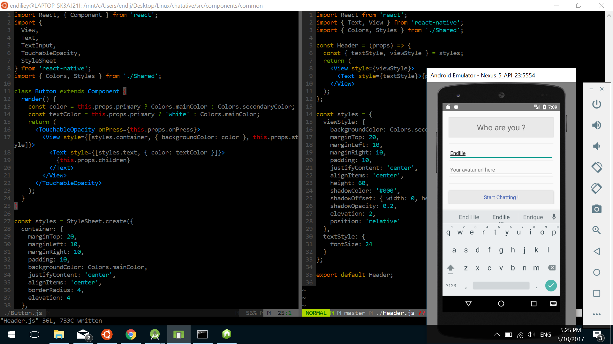
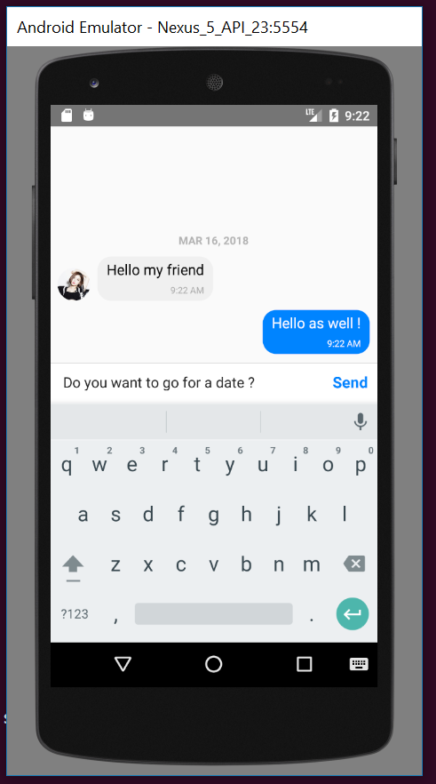

# chatative
:speech_balloon: Chat mobile app in React Native

## Status : IN PROGRESS

## Screenshots

## Info
* **Platform:** iOS & Android
* **State Management:** Redux
* **Code Style:** Standard
* **Unit Test:** None

## Develop
#### iOS
1. `$ npm install`
2. `$ npm start`
3. Open your Xcode, select a simulator, click the play button or `cmd + R`

#### Android
1. Same to [official doc](http://facebook.github.io/react-native/docs/android-setup.html#content)
2. `$ react-native run-android`

## TODO
- [x] ~~Build basic reusable UI components`~~
- [x] ~~Build Login UI~~
- [x] ~~Configure firebase~~
- [ ] Build Chat UI
- [ ] Build all the React-Redux thingy (reducers, actions)
- [ ] Connect the UI with Redux and firebase a.k.a build containers
- [ ] Refactor ??
- [ ] Push Notification ??
